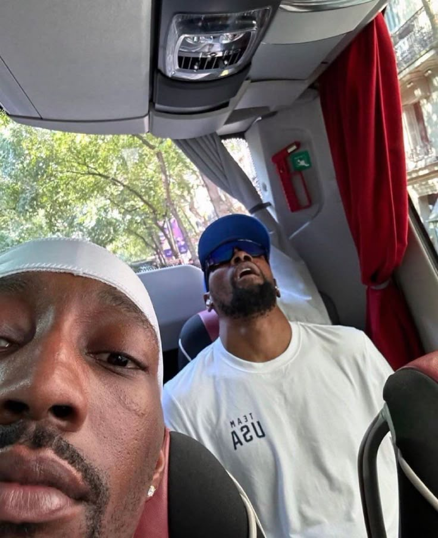

 Template Portfolio
This will be your portfolio repository. Use this as a [template repository](https://docs.github.com/en/repositories/creating-and-managing-repositories/creating-a-template-repository) and customize it to your own tastes. We gave you a starting point with a space to describe yourself and a link to where your assignment 1 file can be.

# About Me
My name is Michael Sun. Outside of school you'd catch me always sipping on a cup of cold brew and being an enthusiast trying out new cuisines to explore different tastes of the world.

Some fun facts about me:
1. I grew up on an island 
2. I love watching basketball and is interested in sports analytics in general.
3. I placed 2nd in my fantasy football leagues twice in a row. Hope to win this year.

# Table of Contents
[Link to Assignment 1](assignments/assignment1.md)
